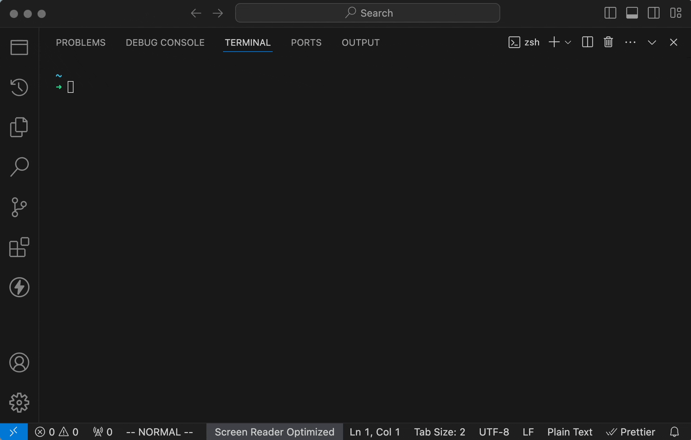

# Memory Spiral

A command-line tool to assist me in learning and reviewing.

See [./index.js](./index.js).



## Get Started

```sh
git clone https://github.com/reasonly7/memory-spiral.git
cd ./memory-spiral
npm pack
npm install -g ./memory-spiral-1.0.0.tgz

# usage
ms
```