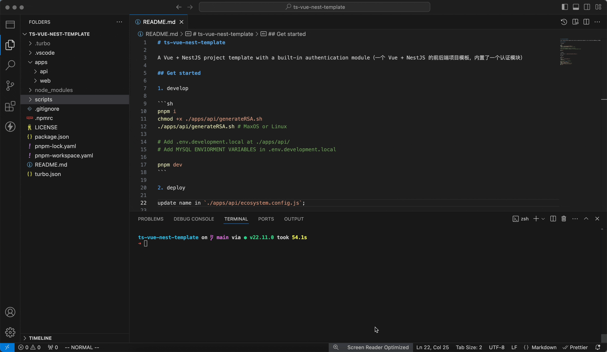

# ts-vue-nest-template

A Vue + NestJS project template with a built-in authentication module（一个 Vue + NestJS 的前后端项目模板，内置了一个认证模块）



## Get started

1. develop

```sh
pnpm i
chmod +x ./apps/api/generateRSA.sh
./apps/api/generateRSA.sh # MaxOS or Linux

# Add .env.development.local at ./apps/api/
# Add MYSQL ENVIORMENT VARIABLES in .env.development.local

pnpm dev
```

2. deploy

update name in `./apps/api/ecosystem.config.js`;

and then: 

```sh
pnpm build

chmod +x ./scrips/deploy.sh
./deploy.sh

# 然后登录服务器进行以下操作：
pnpm install --prod
chmod +x ./generateRSA.sh
./generateRSA.sh # MaxOS or Linux
pm2 start ./ecosystem.config.js
pm2 save
```